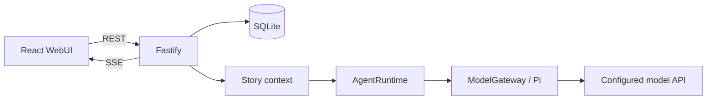

# 架构与开发说明 · Architecture & Development

[中文](#zh-cn) · [English](#english) · [README](../README.md)

这份文档解释当前代码的职责边界和关键约束。用户上手流程见 README；贡献约定以 [AGENTS.md](../AGENTS.md) 为准。

This guide describes the current implementation and its important invariants. Start with the README for usage and [AGENTS.md](../AGENTS.md) for contribution rules.

<a id="zh-cn"></a>

## 中文

### 1. 模块边界

| 目录 | 职责 |
| --- | --- |
| [`apps/web`](../apps/web) | React / Vite 界面、内容自动保存、SSE 消费、浏览器草稿与 PWA 外壳 |
| [`apps/server`](../apps/server) | Fastify API、SQLite / Drizzle、事务、生成生命周期、分支与记录维护 |
| [`packages/contracts`](../packages/contracts) | Zod 输入契约、领域类型、状态字段与原子校验 |
| [`packages/agent-runtime`](../packages/agent-runtime) | 自有 `AgentRuntime` / `ModelGateway` 接口、提示词组装、上下文预算及 Pi 适配 |
| [`packages/plugin-sdk`](../packages/plugin-sdk) | 静态可信插件的注册接口，不是第三方代码沙箱 |

Pi 依赖集中在 `agent-runtime`；前端通过本地服务访问模型，不直接向供应商发送密钥。SQLite 是持久数据来源，浏览器负责界面状态和未提交草稿。

前端通过 `@new-ai-chat/contracts/client` 读取默认设置、状态字段和显示辅助函数；领域类型使用 `import type`。这个入口不加载 Zod 或服务端校验器，服务端仍从原入口执行完整校验。



界面语言由轻量 React 上下文与本地词典提供，保存在浏览器的 `interface-language` 中。应用诊断可携带 `UiText`（文案键与参数），前端按语言显示，原文本保留供兼容和诊断。语言不进入模型请求；状态显示标签与模型字段说明分离。

### 2. 从输入到完整回合

`TurnService` 负责回合生命周期，`StoryContext` 负责读取当前故事位置可见的资料。

1. 前端等待内容自动保存，判断本次是新增 User、回复已有 User、自动续写还是手动录入。
2. 服务端校验聊天位置、发言者和运行状态；新增 User 与必要的主角初始状态在事务内保存。
3. API 写作交给运行时。流式增量先在内存中缓冲，通过 SSE 展示，每条完整正文立即落库。
4. 正文完成后结算逻辑回合，再检查 Memory／状态更新间隔。记录失败或取消不撤销已完成正文。

| 写作模式 | 运行方式 |
| --- | --- |
| 普通写作 | 一次不带工具的正文请求；普通群聊需要明确回复者 |
| Writer Agent | 同一 Agent 会话选择发言者、读取允许的上下文并写作；显式指定身份时跳过选人 |
| Planner＋Writer | Planner 先提交计划，再按计划写作；显式指定身份时跳过前置规划 |

自动计划支持一轮最多两个输出。首条完成、后续失败时保留成文；重试仅补原计划剩余部分，不重复 User 输入。未完成片段不进入故事历史。SSE 使用持久事件游标重放，增量快照用于当前运行；服务重启不会自动重新向供应商发起请求。

手动输入通过 `manualInput` 全局设置控制，使用同一个消息存储。连续新增 User 共用待完成的 `storyTurnId`，随后 Assistant 完成这一轮；连续 Assistant 每条另算一轮。User-only 输入不触发自动总结。普通发送入口在手动模式下拒绝生成，主动续写、改写、行动选项和重试仍可请求模型。

### 3. 消息、分支与记录

`MessageNode.parentId` 构成聊天内的消息树，聊天 head 指向当前路径。正文编辑和 Swipe 产生新节点，保留旧版本；它们与“新建独立故事分支”是不同操作。

- **独立分支**：复制截至目标消息的历史与相关记录到新聊天，以 `branchGroupId` 关联。原聊天继续保留自己的进度。
- **永久删除**：按当前路径上的位置删除本条及后续内容，同时清理同一聊天在该位置及之后的旧走向、关联事件和缓存。事务恢复保留历史的记录；不影响其他独立聊天。
- **书签与固定发送起点**：引用消息节点，不复制故事。固定起点优先于全局历史条数；删除起点时清空引用。

| 记录 | 存储与约束 |
| --- | --- |
| 固定事实 | 用户编辑的分支事件投影；自动 Memory 不覆盖它 |
| Memory | 阶段记录与完整回合覆盖范围；旧记录缺少范围时保持未知 |
| 主角状态 | 分支检查点；修改先验证完整批次，再原子写入 |

主角状态只有六张表：`global_state`、`protagonist_info`、`important_characters`、`protagonist_skills`、`inventory`、`quests_events`。候选行动使用独立缓存，不属于状态表。故事前经历由用户维护；`is_dead` 只表示确认死亡，不能由离场推断。

开启 Memory 发送时，当前分支的全部有效阶段按从前到后发送；预算不足就阻止请求，不按关键词省略旧阶段。旧导入记录取当前位置最新的累积快照，按明确连续的 `[Stage N]:` 前缀拆分，同号内容以该快照为准，后续新记忆接续编号。拆分只影响读取与显示，数据库原记录及历史快照保留，未知覆盖范围不补猜。Agent 的显式搜索工具仍支持本地关键词，不需要向量数据库或额外模型。Memory 与状态共享可选的 `recordConnectionId`，但分别请求、分别按间隔维护；上下文发送开关与自动更新间隔相互独立。

`SessionEvent` 服务于回合日志和部分投影，并非所有数据都采用事件溯源。记录阶段事件也不等于已调用模型：实际是否到更新间隔，由 `RecordService.automatic` 判断。

### 4. 提示词、预算与请求边界

- **固定前缀**：作者注释位于最前面的 System 内容。写作主指令、选中的主角控制、身份与角色资料、附加指令及常驻世界书按固定顺序组装；空白段不生成标题。
- **动态上下文**：历史、检索到的世界书、Memory、状态及后置写作要求随故事位置变化。普通发送的最新原始 User 输入锚点靠后，最终由 `Current Speaker` 指定发言者；自动续写不重复旧输入锚点。
- **提示词预设**：只保存提示词页五项。选择、另存或更新预设不等于应用；应用仍由“保存提示词”完成。
- **网页提示词**：从普通写作的实际 Gateway Body 提取可见文本，移除协议参数和工具结构。它是粘贴文本，不会把网页输入升级为真正的 System 角色。

上下文预算估算模型可见的文本与工具定义，不计算 Trace、时间戳或 `contextReport` 等内部元数据。全局历史条数按实际 User / Assistant 消息计数，0 表示不限；固定范围超限会报错。已选 Memory 不能完整放入预算时也报错，不静默只保留最新条目。

连接配置当前默认温度 1、最大输出 50,000、上下文窗口 1,000,000、推理强度 high。这些是编辑器默认值，不代表任意模型都支持；应根据实际连接调整。Base URL 需包含服务商所要求的协议路径或版本前缀。

原始预览从 `PiModelGateway` 的 fetch 边界捕获首请求，`contextReport` 仅用于解释检索与预算。普通写作历史只回放可见正文；供应商需要的推理签名或不透明状态留在允许它们的 Agent 会话内。缓存是否命中以供应商报告为准，不能由估算或提示词相似程度推断。

### 5. 导入、导出与内部扩展

SillyTavern 导入采用白名单扫描、路径／大小校验、预览确认及事务写入。源目录只读；哈希用于预览过期检查、导入去重和资源寻址，不要求每次改动做全目录哈希验收。未知兼容字段可保留为非运行时数据，旧扩展代码、密钥和高级宏不会执行。

原生故事包重映射 ID 并创建新故事，保留可移植故事资料与本地图片；排除连接、认证信息、Trace、运行任务和不透明供应商状态，不抓取外部图片。资源文件不属于 SQLite 事务，失败可能留下未引用的资源。

内置插件通过静态 bootstrap 注册工具、上下文提供者、回合 hook、投影、设置 schema 和 UI 元数据。模型工具只开放已有只读故事能力；不提供 Shell、任意文件系统、任意网络或 MCP。UI 需要前端静态集成，没有自动加载远程插件代码的机制。

### 6. 运行配置与验证

根目录 `.env` 由任务脚本加载，参考 [`.env.example`](../.env.example)。使用项目启动命令时，相对数据路径以 `apps/server` 为基准。

| 配置 | 默认值 / 用途 |
| --- | --- |
| `HOST` / `PORT` | `127.0.0.1` / `4310` |
| `DATABASE_PATH` | `./data/new-ai-chat.db` |
| `ASSET_DIR` | `./data/assets` |
| `WEB_DIST` | `../web/dist` |
| `PAIRING_TOKEN` | 本机默认不需要；非回环监听必须配置 24–256 位 URL-safe token |

数据库启用 WAL。停止服务后备份整个数据目录；运行中只复制 `.db` 可能遗漏 WAL 中的数据。密钥和自定义头保存在未加密数据库，普通 REST 列表不返回其值。流式请求不向终端打印原始 Body；非流式会打印原始请求和响应，因此日志可能包含完整故事。认证 Header 始终不输出。

局域网客户端先配对，随后使用 HttpOnly / SameSite=Strict Cookie。默认 HTTP 不加密链路，不适合直接暴露公网；项目不会自动配置防火墙或 HTTPS。PWA 缓存静态应用外壳，不缓存聊天 API 供离线使用。

开发入口是 `pnpm dev`；演示用 `pnpm demo`。代码改动按风险选择类型检查、构建和少量相关测试。例如，在仓库根目录验证三协议请求边界：

```sh
pnpm typecheck
pnpm build
pnpm exec vitest run packages/agent-runtime/src/gateway.test.ts -t "sends real stream values"
```

界面测试从 `apps/web` 运行，例如 `pnpm exec playwright test e2e/story.spec.ts --grep "manual input accepts"`；先构建，因为测试服务读取 `apps/web/dist`。测试使用临时数据库、假模型及端口 4319，Windows 默认使用已安装的 Edge。结束后关闭本次启动的进程并确认端口释放。

不默认跑全量回归或真实模型评测；纯文档修改不运行构建与应用测试。历史文件 [ACCEPTANCE.md](ACCEPTANCE.md) 记录当时的验证，不能作为当前版本的完整功能或覆盖率声明。

---

<a id="english"></a>

## English

### 1. Module boundaries

| Directory | Responsibility |
| --- | --- |
| [`apps/web`](../apps/web) | React / Vite UI, autosave, SSE consumption, browser drafts, and the PWA shell |
| [`apps/server`](../apps/server) | Fastify API, SQLite / Drizzle, transactions, generation lifecycle, branches, and record maintenance |
| [`packages/contracts`](../packages/contracts) | Zod input contracts, domain types, state fields, and atomic validation |
| [`packages/agent-runtime`](../packages/agent-runtime) | Owned `AgentRuntime` / `ModelGateway` interfaces, prompts, context budgeting, and Pi adapters |
| [`packages/plugin-sdk`](../packages/plugin-sdk) | Registration interfaces for statically integrated, trusted plugins |

Pi dependencies are contained in `agent-runtime`. The browser talks to the local server rather than sending provider keys directly to a model endpoint. SQLite holds durable data; browser storage holds UI preferences and unsent drafts.

The request path is **WebUI → Fastify → story context → AgentRuntime → ModelGateway / Pi → configured provider**, with SQLite persistence and SSE updates back to the UI.

A lightweight React context and local dictionaries provide the UI language, stored in the browser as `interface-language`. Application diagnostics may carry `UiText` keys and parameters alongside their original text. Language never enters model requests; state display labels are separate from model-facing field descriptions.

The UI reads defaults, state columns, and display helpers from `@new-ai-chat/contracts/client`, and uses `import type` for domain types. This entry point does not load Zod or server validators. Server-side validation continues through the original package entry point.

### 2. From input to a completed turn

`TurnService` owns the turn lifecycle; `StoryContext` reads the material visible at the current story position.

1. The UI flushes pending edits and decides whether to append a User, reply to an existing User, continue automatically, or save manual input.
2. The server validates the head, speaker, and running state. It transactionally saves new User input and any required initial protagonist-state snapshot.
3. API writing goes through the runtime. Streaming deltas are buffered in memory and displayed through SSE; each completed reply is saved immediately.
4. The story turn settles, then Memory and state intervals are checked. Maintenance failure or cancellation does not undo completed prose.

| Writing mode | Execution |
| --- | --- |
| Plain writing | One prose request without tools; plain group chats require an explicit speaker |
| Writer Agent | Select speakers, read permitted context, and write within an Agent session; explicit speakers skip selection |
| Planner＋Writer | Submit a plan before writing; an explicit speaker skips preliminary planning |

An automatic plan contains at most two outputs. If a later output fails, completed prose survives and retry resumes only the remaining plan without duplicating User input. Incomplete fragments do not enter story history. Durable event cursors support SSE replay, while live snapshots represent current buffered output. Restarting the service does not automatically resend requests to a provider.

Global `manualInput` uses the same message store. Consecutive new User messages share a pending `storyTurnId`; the following Assistant completes that turn. Each consecutive Assistant after that starts a new turn. User-only input does not trigger automatic summaries. Manual mode blocks ordinary generation from the send endpoint, while explicit continuation, rewriting, action choices, and retry remain available.

### 3. Messages, branches, and records

`MessageNode.parentId` forms a message tree inside a chat; its head selects the current path. Editing prose or creating a Swipe adds a node and preserves older versions. An independent story branch is a separate operation.

- **Independent branch:** copy history and associated records through a selected message into a new chat, linked by `branchGroupId`. The original chat keeps its progress.
- **Permanent deletion:** remove the selected position and later content, including alternate paths at those positions within the same chat. Clean up associated events and caches transactionally and restore records for retained history. Other independent chats are unaffected.
- **Bookmarks and fixed history starts:** reference message nodes without copying stories. A fixed start overrides the global message-count window; deleting it clears the reference.

| Record | Storage and constraints |
| --- | --- |
| Pinned facts | User-maintained projections of branch events; automatic Memory cannot overwrite them |
| Memory | Stage records with complete-turn coverage; unknown coverage in old records stays unknown |
| Protagonist state | Branch checkpoints; validate the whole edit batch before committing it |

There are six state tables: `global_state`, `protagonist_info`, `important_characters`, `protagonist_skills`, `inventory`, and `quests_events`. Action choices are cached separately. Pre-story experience is user-authored; `is_dead` means confirmed death, not absence from a scene.

When Memory is enabled, all effective stages on the current branch are sent in chronological order. An insufficient budget blocks the request instead of omitting older stages by keyword relevance. Legacy imports use the latest cumulative snapshot at the current story position. Consecutive `[Stage N]:` headers become individual stages, that snapshot supplies each stage's current text, and newer memories continue the numbering. This is a read-time projection: original database records and historical snapshots remain intact, and unknown coverage is not inferred. Explicit Agent search tools still support local keywords without a vector database or extra model call. Memory and state share the optional `recordConnectionId` but run separate requests at their own intervals. Context inclusion switches and automatic update intervals are independent settings.

`SessionEvent` supports turn logs and selected projections; this is not a fully event-sourced CRUD system. A record-phase event does not itself prove a model request occurred: `RecordService.automatic` decides whether an interval is due.

### 4. Prompts, budgets, and the request boundary

- **Fixed prefix:** the author's note leads the System content. Main instructions, selected protagonist control, identity and character data, additional instructions, and constant lore follow a defined order. Empty sections produce no heading.
- **Dynamic context:** history, retrieved lore, Memory, state, and final writing instructions vary by story position. Ordinary sends place the latest original User input near the end, followed by `Current Speaker`; automatic continuation does not repeat an old input anchor.
- **Prompt presets:** contain only the five prompt-page fields. Loading or saving a preset does not apply it; the explicit Save Prompts action does.
- **Web prompts:** extract visible text from the actual plain-writing Gateway body, leaving out protocol parameters and tool structures. Pasting this text does not create a real System role in an AI website.

Budgeting estimates model-visible text and tool definitions, excluding traces, timestamps, `contextReport`, and other internal metadata. The global history count includes actual User / Assistant messages; zero means unlimited. Fixed history ranges that exceed the budget fail. Selected Memory must also fit in full; the runtime does not silently keep only its newest entries.

Connection editor defaults are temperature 1, maximum output 50,000, context window 1,000,000, and reasoning high. These are application defaults, not capability claims for every model; adjust them to the actual connection. The base URL must include any protocol path or version prefix required by the provider.

Raw preview captures the first body at the `PiModelGateway` fetch boundary. `contextReport` explains retrieval and budgeting rather than substituting for the transport body. Plain writing replays visible prose only; required reasoning signatures and opaque state stay within Agent sessions that permit them. Cache hits must come from provider-reported metrics, not estimates or assumptions about similar prompts.

### 5. Import, export, and internal extensions

SillyTavern import uses allowlisted scans, path and size checks, a preview step, and transactional writes. The source is read-only. Hashes serve preview freshness checks, import deduplication, and resource addressing; they are not a requirement for whole-directory verification on every change. Unknown compatibility fields may be retained as non-runtime data. Old extension code, keys, and advanced macros are not executed.

Native story packages remap IDs and create new stories. They contain portable story data and local images, excluding connections, credentials, traces, running tasks, and opaque provider state. External images are not fetched. Filesystem assets are outside the SQLite transaction, so a failed import can leave unreferenced resources.

Trusted internal plugins register tools, context providers, turn hooks, projections, settings schemas, and UI metadata through a static bootstrap. Model tools are limited to existing read-only story capabilities: no Shell, arbitrary filesystem, arbitrary network, or MCP access. UI modules require static frontend integration; there is no remote plugin-code loader or sandbox for untrusted plugins.

### 6. Configuration and verification

Task scripts load the root `.env`; use [`.env.example`](../.env.example) as a reference. With the project's startup commands, relative data paths resolve from `apps/server`.

| Setting | Default / purpose |
| --- | --- |
| `HOST` / `PORT` | `127.0.0.1` / `4310` |
| `DATABASE_PATH` | `./data/new-ai-chat.db` |
| `ASSET_DIR` | `./data/assets` |
| `WEB_DIST` | `../web/dist` |
| `PAIRING_TOKEN` | Optional on loopback; non-loopback binding requires a 24–256 character URL-safe token |

SQLite uses WAL. Stop the service before copying the whole data directory for backup; copying only a live `.db` can miss WAL data. Keys and custom headers are stored in the unencrypted database and omitted from normal REST listings. Streaming requests do not print raw bodies to the terminal. Non-streaming requests print raw request and response bodies, so logs may contain full story text. Authentication headers are never printed.

LAN clients pair first, then use an HttpOnly / SameSite=Strict cookie. Default HTTP does not encrypt traffic and is unsuitable for direct public exposure. The project does not configure a firewall or HTTPS automatically. PWA caching covers the static shell, not an offline copy of the chat API.

Use `pnpm dev` for development and `pnpm demo` for the fake-model demo. Choose type checks, builds, and focused tests according to the change. For example, from the repository root, to check the three protocol request boundaries:

```sh
pnpm typecheck
pnpm build
pnpm exec vitest run packages/agent-runtime/src/gateway.test.ts -t "sends real stream values"
```

Run browser tests from `apps/web`, for example `pnpm exec playwright test e2e/story.spec.ts --grep "manual input accepts"`. Build first: the test service reads `apps/web/dist`. It uses a temporary database, fake models, and port 4319; Windows defaults to the installed Edge browser. Shut down processes started for verification and confirm their ports are released.

Full regressions and real-model evaluations are not the default. Documentation-only changes do not require builds or application tests. [ACCEPTANCE.md](ACCEPTANCE.md) is a historical record, not a claim about current feature support or test coverage.
